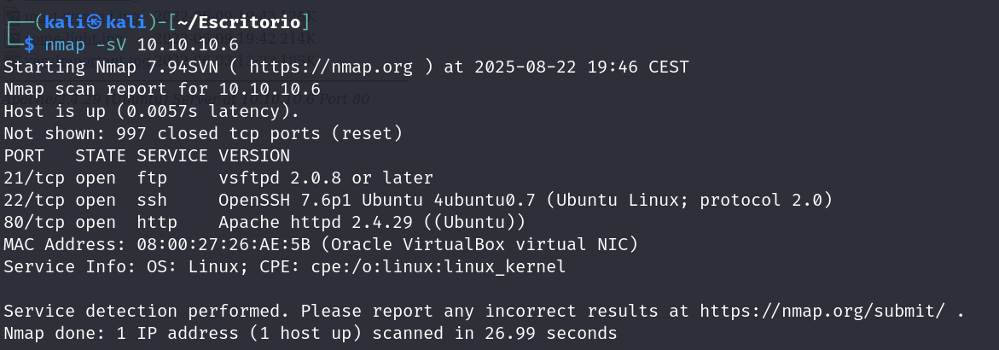

## Fase de renconcimiento:

### nmap:

Primero hago un reconocimiento de los servicios que tiene el sistema:

<<<<<<< HEAD
=======

>>>>>>> 77d070b3029496258958a252a6c060df71255a66

Con gobuster realizo un escaneo en busqueda de rutas ocultas del servicio http

## Fase de explotación

## Fase de escalada de privilegios
